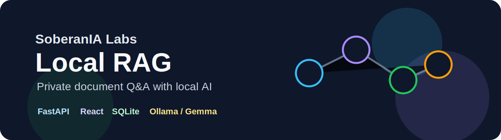

**Local-first** · **FastAPI** · **React** · **SQLite** · **Ollama** · **Gemma** · **EmbeddingGemma**

# SoberanIA Labs Local RAG

Local-first retrieval-augmented generation application for chatting with private documents using FastAPI, React, SQLite and local AI through Ollama/Gemma.

## Overview

SoberanIA Labs Local RAG provides a private-by-default workflow for indexing local documents and asking grounded questions about their content. Documents, chunks and embeddings remain in local SQLite storage, while answer generation can run through locally installed Ollama models.

This repository is a reference implementation for local and small-dataset use. It is not presented as a production SaaS.

## Public repository safety

This public repository contains source code, documentation, deterministic demo fixtures and configuration examples only.

It does not include real user documents, local SQLite databases, generated uploads, real `.env` files, API keys, downloaded Ollama model files or local installer artifacts. The launcher, backend and frontend flows are designed for localhost use through `127.0.0.1` or `localhost`.

See [`SECURITY.md`](SECURITY.md) and [`docs/SECURITY_PRIVACY.md`](docs/SECURITY_PRIVACY.md) for the full local-use security boundary.

## Capabilities

- Create documents from pasted text.
- Upload `.txt`, `.md`, `.markdown` and text-based `.pdf` files.
- Split content into overlapping chunks.
- Generate local embeddings through Ollama.
- Store documents, chunks and embeddings in SQLite.
- Retrieve relevant chunks with cosine similarity.
- Generate contextual answers with source attribution.
- Show source chunks, similarity scores, model metadata and latency.
- List and delete indexed documents.
- Install the frontend as a local PWA app shell on supported browsers.
- Prepare a Windows one-click local startup flow with desktop shortcut creation.
- Validate the application without local model downloads through deterministic test providers.

## RAG flow

~~~text
Document or file upload
  -> parsing and normalization
  -> chunking with overlap
  -> embeddings
  -> SQLite storage
  -> question embedding
  -> cosine similarity retrieval
  -> Ollama/Gemma answer generation
  -> answer with sources
~~~

## Validated status

| Path | Status |
| --- | --- |
| Text and Markdown ingestion | Validated |
| Text-based PDF ingestion | Validated |
| Deterministic test mode | Validated with mock/hash providers |
| Gemma 3 local runtime | Validated with `gemma3:4b` |
| Gemma 4 local runtime | Validated with `gemma4:e2b` |
| Local embedding runtime | Validated with `embeddinggemma` |
| Full local Ollama RAG flow | Validated with `gemma3:4b` and `gemma4:e2b` using `embeddinggemma` |
| Windows one-click startup flow | Validated locally with desktop shortcut and app opening at `http://127.0.0.1:4182` |

See [`docs/VALIDATION.md`](docs/VALIDATION.md) for scope and limitations.

## Stack

| Layer | Technology |
| --- | --- |
| Frontend | React, TypeScript, Vite, responsive CSS |
| Backend | Python, FastAPI, Pydantic, SQLite, httpx |
| RAG | chunking, embeddings, cosine similarity, source attribution |
| Local AI | Ollama, Gemma, EmbeddingGemma |
| Tests | pytest, FastAPI TestClient, TypeScript typecheck |
| Quality | Ruff, mypy, frontend build |
| Infrastructure | Docker Compose, GitHub Actions |

## Quick start

Prerequisites and additional options are documented in [`docs/LOCAL_SETUP.md`](docs/LOCAL_SETUP.md).

### Windows setup from a fresh clone

This is the easiest path for Windows users who want to try the local app without manually starting backend and frontend in separate terminals.

Install these external dependencies first:

- Git
- Python 3.12+
- uv
- Node.js/npm
- Ollama

Then clone the repository and enter the project folder:

~~~powershell
cd $HOME\dev
git clone https://github.com/selvalabs/sialabs-local-rag.git
cd sialabs-local-rag
~~~

Pull the local AI models used by the default Windows flow:

~~~powershell
ollama pull gemma4:e2b
ollama pull embeddinggemma
~~~

Prepare the local Windows app flow:

~~~powershell
.\scripts\install-windows-app.ps1
~~~

This installs/syncs dependencies, builds the frontend and creates a desktop shortcut named `SIALabs Local RAG`.

Start the app with the desktop shortcut or run:

~~~powershell
.\scripts\start-local-app.ps1
~~~

The app opens at:

~~~text
http://127.0.0.1:4182
~~~

This is not a signed `.exe` installer yet. It is the current local Windows startup flow used as the base for future packaging. See [`installer/windows/README.md`](installer/windows/README.md) for details.

### Manual development setup

Terminal 1 — backend:

~~~powershell
cd backend
uv sync --dev
uv run uvicorn sialabs_local_rag.main:app --reload --host 0.0.0.0 --port 8000
~~~

Terminal 2 — frontend:

~~~powershell
cd frontend
npm ci
npm run dev
~~~

Open:

- Frontend: `http://localhost:5173`
- API: `http://localhost:8000`
- Swagger/OpenAPI: `http://localhost:8000/docs`

## Run with Ollama and Gemma

Install and start Ollama locally, then pull validated models:

~~~powershell
ollama pull gemma4:e2b
ollama pull gemma3:4b
ollama pull embeddinggemma
~~~

Configure the backend for local AI:

~~~powershell
$env:LLM_PROVIDER = "ollama"
$env:EMBEDDING_PROVIDER = "ollama"
$env:OLLAMA_BASE_URL = "http://localhost:11434"
$env:OLLAMA_CHAT_MODEL = "gemma4:e2b"
$env:OLLAMA_EMBED_MODEL = "embeddinggemma"

cd backend
uv run uvicorn sialabs_local_rag.main:app --reload --host 0.0.0.0 --port 8000
~~~

Run a direct model availability and smoke check:

~~~powershell
powershell -ExecutionPolicy Bypass -File .\scripts\check-ollama.ps1 -RunSmokeRequests
~~~

## Lightweight validation mode

For CI, automated tests and machines without local models:

~~~env
LLM_PROVIDER=mock
EMBEDDING_PROVIDER=hash
~~~

This mode validates the application pipeline deterministically. It is not semantically equivalent to real local embeddings or model generation.

## Use the app

1. Start the backend and frontend, or use the Windows shortcut/start script.
2. Open `http://127.0.0.1:4182` for the Windows one-click flow, or `http://localhost:5173` for the manual dev server.
3. Create a document from pasted text or upload a supported file.
4. Wait for indexing to complete.
5. Ask a question about the indexed content.
6. Review the answer and retrieved sources.
7. Delete documents when they are no longer needed.

Seed reproducible demo content with:

~~~powershell
powershell -ExecutionPolicy Bypass -File .\scripts\seed-demo.ps1
~~~

Suggested question:

~~~text
How does SoberanIA Labs Local RAG let you chat with private documents locally?
~~~

## Installable app shell

The frontend can be installed as a PWA app shell on supported browsers. This installs the interface only. The FastAPI backend, SQLite database and Ollama runtime still run locally outside the browser.

Build and preview the frontend shell:

~~~powershell
cd frontend
npm run build
npm run preview -- --host 0.0.0.0
~~~

Open the preview URL, usually `http://localhost:4173`, then use the browser install action.

The PWA service worker caches static frontend assets only. It intentionally does not cache API responses, private document contents or chat responses.

If the backend is stopped, the installed app displays an actionable local API unavailable message. Start the backend on `http://localhost:8000` and reload the app.

## Documentation

| Topic | Document |
| --- | --- |
| Architecture and trade-offs | [`docs/ARCHITECTURE.md`](docs/ARCHITECTURE.md) |
| API contract | [`docs/API.md`](docs/API.md) |
| Local setup | [`docs/LOCAL_SETUP.md`](docs/LOCAL_SETUP.md) |
| Local AI configuration | [`docs/LOCAL_AI.md`](docs/LOCAL_AI.md) |
| Windows one-click startup flow | [`installer/windows/README.md`](installer/windows/README.md) |
| Installer and release artifact flow | [`docs/INSTALLERS.md`](docs/INSTALLERS.md) |
| Security policy | [`SECURITY.md`](SECURITY.md) |
| Security and privacy | [`docs/SECURITY_PRIVACY.md`](docs/SECURITY_PRIVACY.md) |
| Testing strategy | [`docs/TESTING.md`](docs/TESTING.md) |
| Reproducible demo | [`docs/DEMO.md`](docs/DEMO.md) |
| Validation evidence | [`docs/VALIDATION.md`](docs/VALIDATION.md) |

## Validation

Run the complete local validation suite:

~~~powershell
powershell -ExecutionPolicy Bypass -File .\scripts\validate-local.ps1
~~~

It runs backend dependency checks, Ruff, pytest, mypy, frontend installation, TypeScript typecheck, frontend build and Docker Compose configuration validation.

## Known limitations

- SQLite plus Python similarity search is intended for local use and small datasets, not large-scale vector search.
- The application has no authentication or authorization.
- It must not be exposed publicly without an additional security layer.
- PDF support is limited to extractable text.
- Scanned PDFs, OCR, image extraction and table reconstruction are not supported.
- Full RAG flow was validated with both `gemma3:4b` and `gemma4:e2b` using `embeddinggemma`.
- No performance benchmark or answer-quality benchmark is claimed.

## License

MIT. See `LICENSE`.
