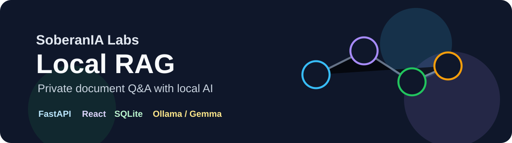

# SoberanIA Labs Local RAG

**Local-first document intelligence with hybrid retrieval, structured source citations, incremental collections and measurable evaluation.**

SIALabs Local RAG is a local knowledge workspace for small and medium document sets. It ingests heterogeneous files, indexes them in SQLite, retrieves evidence with dense and lexical search, and generates answers through a local Ollama runtime when enabled.

This is a single-user, local reference implementation. It is not a hosted service, multi-tenant SaaS, or signed native installer.

## Public showcase release

This repository is a curated, sanitized public release of a project developed in a private engineering repository. It contains the reviewable release source, reproducible validation, documentation and CI configuration. Intermediate development branches, issues and experiments remain private; the public history starts from the validated showcase release.

## Why this is more than a PDF chat

- **Hybrid retrieval:** dense embeddings plus SQLite FTS5 lexical search fused with weighted reciprocal rank fusion (RRF).
- **Structured evidence:** source cards preserve page, section, slide, sheet, cell-range and locator metadata where parsers can extract it.
- **Collections:** local folders can be scanned incrementally, scoped during retrieval, and reconciled by content hash.
- **Embedding lifecycle:** the index records provider, model and dimension so incompatible spaces can request a reindex.
- **Measurable behavior:** deterministic evaluation reports document hit rate, evidence recall, MRR, category metrics and negative no-answer accuracy.
- **Local boundary:** documents, embeddings and chat history stay in the local SQLite data directory; Ollama is optional and local.

## Capabilities

The current implementation supports:

- pasted text and `.txt`, `.md`, `.markdown`, `.pdf`, `.docx`, `.pptx`, `.xlsx`, `.png`, `.jpg`, `.jpeg`, `.tif` and `.tiff` uploads;
- structured parsing for Office documents and text PDFs;
- optional image/OCR paths when the corresponding local dependency is installed;
- chunking with source metadata and overlap;
- dense, lexical and hybrid retrieval modes;
- collections, folder rescan, missing-source policy and collection-scoped retrieval;
- prompt/evidence separation so conversation context is not treated as document evidence;
- grounded answers, explicit no-answer behavior and source identifiers;
- index health, embedding compatibility and reset workflows;
- deterministic `mock`/`hash` validation and local Ollama/Gemma semantic execution;
- an installable frontend shell, Docker Compose, and a Windows local-app startup flow.

## Architecture

```text
file or pasted text
  -> parser and structural metadata
  -> bounded chunking
  -> local embedding + SQLite storage
  -> dense candidates + FTS5 lexical candidates
  -> weighted RRF fusion and score gate
  -> source cards and grounded prompt
  -> local chat provider response
```

The backend is FastAPI/Python; the frontend is React/TypeScript/Vite; SQLite stores documents, chunks, embeddings, collections and chat metadata. See [`docs/ARCHITECTURE.md`](docs/ARCHITECTURE.md) and [`docs/CASE_STUDY.md`](docs/CASE_STUDY.md).

## Quick start: deterministic local validation

Prerequisites: Python 3.12+, `uv`, Node.js/npm and Docker for container checks.

```powershell
$env:LLM_PROVIDER = "mock"
$env:EMBEDDING_PROVIDER = "hash"
powershell -ExecutionPolicy Bypass -File .\scripts\validate-local.ps1
```

Manual development uses loopback:

```powershell
# Terminal 1
cd backend
uv sync --dev
uv run uvicorn sialabs_local_rag.main:app --reload --host 127.0.0.1 --port 8000
```

```powershell
# Terminal 2
cd frontend
npm ci
npm run dev
```

Open `http://127.0.0.1:5173`; the API and OpenAPI documentation are at `http://127.0.0.1:8000` and `/docs`.

## Quick start: local Ollama

```powershell
ollama pull gemma4:e2b
ollama pull embeddinggemma

$env:LLM_PROVIDER = "ollama"
$env:EMBEDDING_PROVIDER = "ollama"
$env:OLLAMA_BASE_URL = "http://127.0.0.1:11434"
$env:OLLAMA_CHAT_MODEL = "gemma4:e2b"
$env:OLLAMA_EMBED_MODEL = "embeddinggemma"
cd backend
uv run uvicorn sialabs_local_rag.main:app --reload --host 127.0.0.1 --port 8000
```

Use `scripts/check-ollama.ps1 -RunSmokeRequests` to check model availability. Real model evaluation is optional because it depends on local hardware and downloaded models. See [`docs/LOCAL_AI.md`](docs/LOCAL_AI.md) and [`docs/RETRIEVAL_EVALUATION.md`](docs/RETRIEVAL_EVALUATION.md).

## Docker and Windows flows

```powershell
Copy-Item .env.example .env
docker compose build
docker compose --profile llm up
```

Published ports are loopback-only: backend `127.0.0.1:8000`, frontend `127.0.0.1:5173`, and Ollama `127.0.0.1:11434` when enabled. Images and dependency lockfiles are pinned; the frontend uses `npm ci` and the backend uses frozen `uv` synchronization.

On Windows, `scripts/install-windows-app.ps1` prepares the local frontend and shortcut-oriented startup flow. `scripts/start-local-app.ps1` starts local services and opens the application. This is not a signed `.exe` or `.msi`; see [`installer/windows/README.md`](installer/windows/README.md).

## Reproducible demo

Seed synthetic content with:

```powershell
powershell -ExecutionPolicy Bypass -File .\scripts\seed-demo.ps1
```

The recommended demo shows collection selection, heterogeneous sources, a grounded answer with structured source cards, an exact-term lexical rescue, a follow-up question, a no-answer case, and index health. The complete capture checklist is in [`docs/DEMO_PACK.md`](docs/DEMO_PACK.md), using synthetic data and making no claim for assets that are not checked in.

## Testing and evidence

Local gates cover:

- backend Pytest, Ruff and Mypy;
- frontend Vitest, TypeScript typecheck and production build;
- OpenAPI contract/export and generated TypeScript types;
- Playwright browser checks, including mock-driven UI coverage and an integrated
  React → FastAPI → SQLite → hash-retrieval → source flow in CI;
- Docker image builds and Compose assertions;
- upload bounds/signatures, mutation boundaries and prompt-injection regressions;
- deterministic retrieval evaluation and retrieval-scale measurement;
- dependency audit; security boundaries and limitations are documented separately.

Run `scripts/validate-local.ps1`. Details and known skips are in [`docs/TESTING.md`](docs/TESTING.md), [`docs/VALIDATION.md`](docs/VALIDATION.md) and [`docs/RELEASE_READINESS.md`](docs/RELEASE_READINESS.md).

## Security and privacy boundary

The intended boundary is a trusted local user on a local machine. There is no multi-user authentication or authorization. Backend, frontend and Ollama endpoints are intended to remain on loopback and must not be exposed directly to the internet. Local SQLite data is not encrypted at rest; anyone who can read the data directory can read indexed content, embeddings and persisted chat metadata.

Uploads are bounded and checked before parsing, retrieved document text is treated as untrusted data in prompts, and mutating local routes apply origin/fetch-site protections. These controls reduce accidental exposure; they do not turn the project into a public multi-user service. See [`SECURITY.md`](SECURITY.md) and [`docs/SECURITY_PRIVACY.md`](docs/SECURITY_PRIVACY.md).

## Known limitations

- SQLite/Python retrieval targets local and small-to-medium datasets. The versioned
  benchmark covers 1,000–50,000 synthetic chunks; on the recorded Windows machine,
  warm dense retrieval rose from 230 ms at 1,000 chunks to 25.3 s at 50,000 chunks.
  These measurements are machine-specific and are not a universal latency SLO;
  see [`docs/ADR_RETRIEVAL_SCALE.md`](docs/ADR_RETRIEVAL_SCALE.md) and the
  versioned result at `backend/benchmarks/results/retrieval-scale-local.json`.
- OCR and image parsing depend on optional local capabilities; layout/table reconstruction is not guaranteed.
- Text extraction quality varies by PDF and Office document structure.
- Real Ollama quality and latency depend on model, hardware and warm/cold state.
- The deterministic hash provider is a regression tool, not a substitute for semantic embedding quality.
- The project does not claim general-domain answer quality, enterprise readiness, encryption at rest, public hosting, or a signed installer.
- Browser E2E requires a locally installed Playwright browser. CI runs the two
  mock-driven UI tests and a deterministic integrated flow from React through
  FastAPI, SQLite and hash retrieval to a response with a source; this path does
  not require Ollama or a GPU.

## Documentation map

| Topic | Document |
| --- | --- |
| Architecture and trade-offs | [`docs/ARCHITECTURE.md`](docs/ARCHITECTURE.md) |
| API contract | [`docs/API.md`](docs/API.md) |
| Local setup | [`docs/LOCAL_SETUP.md`](docs/LOCAL_SETUP.md) |
| Local AI configuration | [`docs/LOCAL_AI.md`](docs/LOCAL_AI.md) |
| Collections and incremental scan | [`docs/COLLECTIONS.md`](docs/COLLECTIONS.md) |
| Retrieval evaluation | [`docs/RETRIEVAL_EVALUATION.md`](docs/RETRIEVAL_EVALUATION.md) |
| Reproducible demo | [`docs/DEMO_PACK.md`](docs/DEMO_PACK.md) |
| Technical case study | [`docs/CASE_STUDY.md`](docs/CASE_STUDY.md) |
| Testing strategy | [`docs/TESTING.md`](docs/TESTING.md) |
| Security and privacy | [`docs/SECURITY_PRIVACY.md`](docs/SECURITY_PRIVACY.md) |
| Release readiness | [`docs/RELEASE_READINESS.md`](docs/RELEASE_READINESS.md) |
| Contribution guide | [`CONTRIBUTING.md`](CONTRIBUTING.md) |
| Change history | [`CHANGELOG.md`](CHANGELOG.md) |
| Third-party notices | [`THIRD_PARTY_NOTICES.md`](THIRD_PARTY_NOTICES.md) |

## License

MIT. See [`LICENSE`](LICENSE) and [`THIRD_PARTY_NOTICES.md`](THIRD_PARTY_NOTICES.md).
