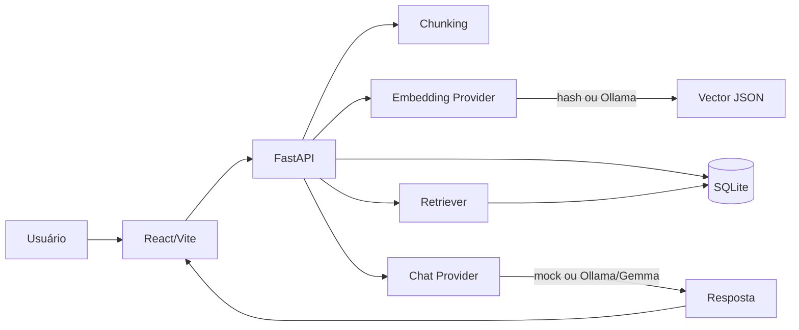

# Architecture

## Visão geral

O SoberanIA Labs Local RAG é uma aplicação local-first composta por frontend React, backend FastAPI, banco SQLite e integração opcional com Ollama.

## Decisões principais

### Local-first

Os documentos e embeddings ficam em SQLite local. A aplicação não envia conteúdo para APIs externas por padrão. Isso reforça a tese de soberania digital e facilita demos controladas.

### Providers intercambiáveis

O backend separa contrato e implementação:

- `EmbeddingProvider`: `hash` ou `ollama`.
- `ChatProvider`: `mock` ou `ollama`.

Essa escolha permite CI sem dependência de modelo local e uso real com Ollama em ambiente de desenvolvimento.

### SQLite no MVP

SQLite reduz complexidade operacional e facilita execução por recrutadores. O cálculo vetorial em Python é suficiente para um dataset pequeno de demonstração.

### API-first

O frontend consome endpoints REST documentados automaticamente pelo FastAPI. Isso evidencia capacidade de integração e separação clara entre camadas.

## Fluxo RAG

1. Usuário cria documento ou faz upload de texto, Markdown ou PDF com texto selecionável.
2. Backend normaliza o conteúdo.
3. Backend quebra o conteúdo em chunks com overlap.
4. Provider gera embeddings para cada chunk.
5. SQLite salva documento, chunks e embeddings em JSON.
6. Usuário envia pergunta.
7. Pergunta é embeddada.
8. Backend calcula similaridade de cosseno contra chunks.
9. Top K chunks formam contexto do prompt.
10. Provider de chat gera resposta.
11. API retorna resposta, fontes, scores e metadados.

## Trade-offs assumidos

| Decisão | Benefício | Custo |
| --- | --- | --- |
| SQLite + JSON embeddings | setup simples | não escala para grandes bases |
| Hash embeddings em CI | validação sem modelo | não é semântico como embedding real |
| FastAPI | documentação automática | backend em stack separada do frontend |
| Sem auth no MVP | foco local-first | não deve ir para internet sem proteção |
| PDF apenas com texto selecionável | suporte documental útil sem OCR | PDFs escaneados ficam fora do escopo |

