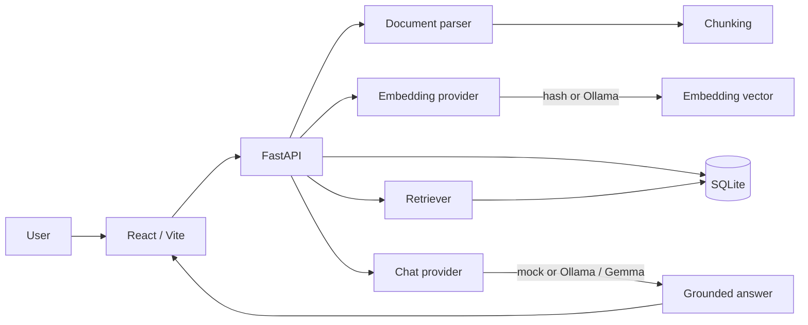

# Architecture

## Overview

SoberanIA Labs Local RAG is a local-first application composed of a React frontend, a FastAPI backend, SQLite storage and optional local model execution through Ollama.

## Design principles

### Local-first data handling

Documents, chunks, embeddings and chat records are stored in local SQLite storage. The default architecture does not require sending document content to an external model API.

### Interchangeable providers

The backend separates provider contracts from their implementations:

- `EmbeddingProvider`: `hash` or `ollama`.
- `ChatProvider`: `mock` or `ollama`.

This allows deterministic automated validation while preserving a real local AI path for normal use.

### SQLite for local scope

SQLite keeps setup and operation simple for a local, single-user application. Similarity search is performed in Python and is appropriate for small document collections.

### API-first separation

The frontend consumes REST endpoints exposed by FastAPI. OpenAPI documentation is generated automatically at `/docs`.

## RAG flow

1. The user creates a document or uploads text, Markdown or a PDF with extractable text.
2. The backend parses and normalizes the content.
3. The content is split into overlapping chunks.
4. The configured embedding provider generates vectors for each chunk.
5. SQLite stores the document, chunks and vectors.
6. The user submits a question.
7. The question is embedded with the configured provider.
8. The retriever calculates cosine similarity against stored chunks.
9. The top-ranked chunks form the model context.
10. The chat provider generates an answer from that context.
11. The API returns the answer, sources, scores and runtime metadata.

## Trade-offs

| Decision | Benefit | Limitation |
| --- | --- | --- |
| SQLite with JSON embeddings | Minimal setup and portable local storage | Not intended for large-scale vector search |
| Python cosine similarity | Transparent and dependency-light retrieval | Linear search cost grows with the dataset |
| Deterministic providers for tests | Fast and reproducible CI | Not semantically equivalent to real models |
| FastAPI backend | Typed contracts and automatic OpenAPI docs | Separate runtime from the frontend |
| No authentication in the local MVP | Lower local setup complexity | Unsafe for direct public exposure |
| Text-only PDF extraction | Useful PDF support without OCR infrastructure | Scanned PDFs and complex layouts are unsupported |
