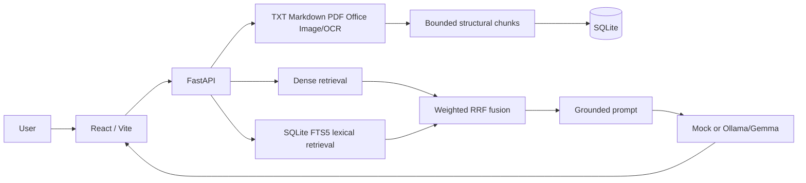

# Architecture

SIALabs Local RAG is a local-first workspace composed of a React frontend, FastAPI backend, SQLite storage and optional local model execution through Ollama.

## System flow

```mermaid
flowchart LR
  User[User] --> UI[React / Vite]
  UI --> API[FastAPI]
  API --> Parser[TXT Markdown PDF Office Image/OCR]
  Parser --> Chunker[Bounded structural chunks]
  Chunker --> Store[(SQLite)]
  API --> Dense[Dense retrieval]
  API --> Lexical[SQLite FTS5 lexical retrieval]
  Dense --> RRF[Weighted RRF fusion]
  Lexical --> RRF
  RRF --> Prompt[Grounded prompt]
  Prompt --> LLM[Mock or Ollama/Gemma]
  LLM --> UI
```

## Design principles

### Local-first data handling

Documents, chunks, embeddings, collections and chat metadata remain in local SQLite storage. The default architecture does not require document content to be sent to an external model API. The local database is not encrypted at rest.

### Interchangeable providers

- EmbeddingProvider: deterministic hash or local ollama.
- ChatProvider: deterministic mock or local ollama.

This makes automated validation reproducible while preserving a real local AI path.

### Structured ingestion

Parsers preserve page, section, slide, sheet, cell-range and source-locator metadata where available. Office formats and optional OCR paths are supported, with explicit parser and upload bounds.

### Hybrid retrieval

Dense retrieval ranks embedding candidates by cosine similarity. Lexical retrieval uses SQLite FTS5 for exact terms and identifiers. Hybrid mode combines the channels with weighted reciprocal rank fusion (RRF) before the score gate and top-k selection. The UI exposes retrieval mode, channel ranks and fusion metadata so score is not presented as one universal measure.

### Collections and index lifecycle

Collections scope retrieval before ranking and support incremental folder scans by content hash. The embedding index records provider, model and dimension; incompatible signatures produce an explicit reindex state instead of silently mixing vector spaces.

### API-first separation

The frontend consumes FastAPI REST endpoints and generated OpenAPI types. OpenAPI documentation is available at /docs.

## End-to-end retrieval

1. Parse and normalize an upload or pasted document.
2. Split content into bounded overlapping structural chunks.
3. Generate and persist local embeddings.
4. Store source metadata and collection membership in SQLite.
5. Embed the question and build dense and lexical candidate lists.
6. Fuse candidates with dense/lexical RRF and apply the relevance gate.
7. Build a prompt where retrieved text is evidence and conversation context is separate.
8. Generate a mock or Ollama answer.
9. Return source cards, locators, retrieval metadata and runtime latency.

## Trade-offs

| Decision | Benefit | Limitation |
| --- | --- | --- |
| SQLite with JSON embeddings | Minimal setup and portable local storage | Not intended for large-scale vector search |
| Dense plus FTS5 hybrid retrieval | Semantic matching plus exact-term rescue | Ranking quality depends on corpus and model |
| Weighted RRF | Combines channels without pretending scores share a scale | Requires documented weights and regression fixtures |
| Deterministic providers | Fast, reproducible CI and no model download | Not semantic model quality |
| Optional OCR | Supports image/scanned paths when installed | Accuracy and layout reconstruction vary |
| No authentication in local MVP | Low setup complexity | Unsafe for direct public exposure |
